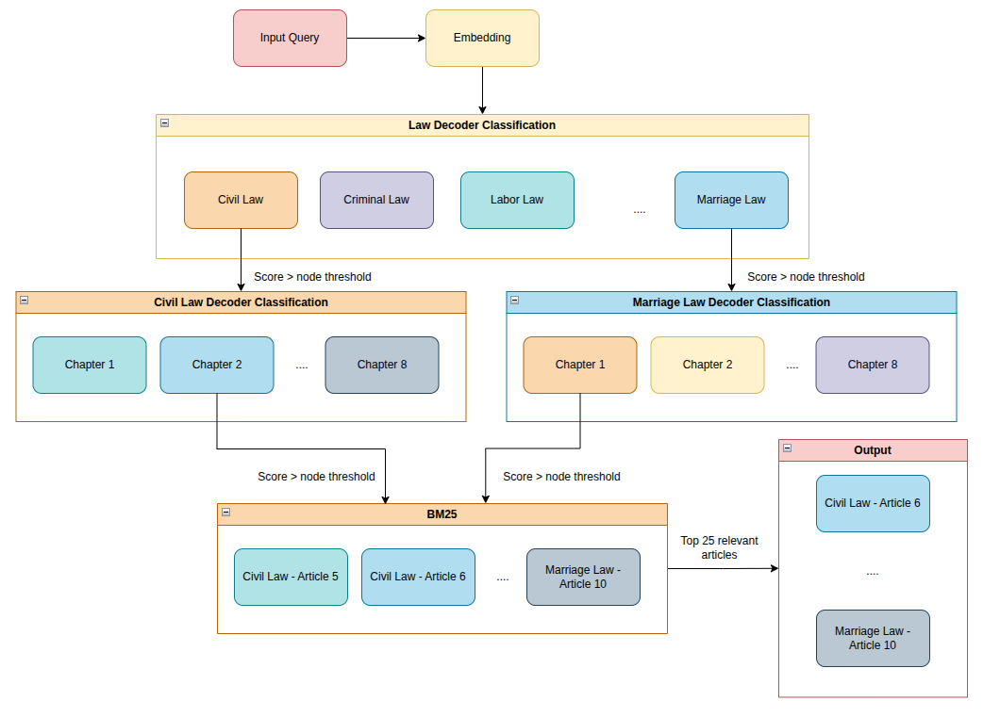
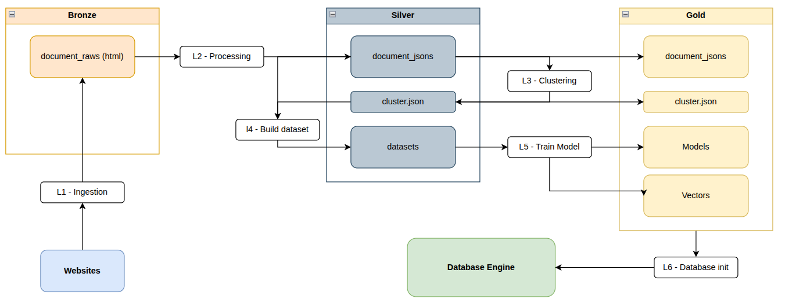

# Legal Answering System

The Legal Answering System is a high-performance framework designed for searching and reasoning over massive legal corpora. By leveraging the inherent hierarchical structure of legal documents, the system provides a more accurate and scalable alternative to traditional "flat" RAG (Retrieval-Augmented Generation).
- **Data structure for high accurate search**: Automatically organizes documents into a global tree structure and train classification models to prune irrelevant sub-sets. This allow the system only go through relevant parts of the document tree, ensuring accuracy and speed.

- **High-Performance C++ Engine**: A custom-built tree database implemented from scratch in C++. Focusing on low-latency traversal and memory efficiency.

>[!NOTE]
Since the document is extracted from different sources, including private websites. The `l1_ingestion` is hidden and only keep a small sample of documents already constructed in `data\20260226\silver`.

## Aims
The rise of LLMs and RAG has significantly improved how legal systems handle user inquiries. However, traditional RAG often hits a bottleneck with large-scale data; which the system has to search through large set of chunks, having potential of extracting irrelevant content. While Knowledge Graphs can improve accuracy, the complexity of building and maintaining them remains a major challenge.

This project aims to bridge that gap by providing a scalable solution for legal and general full-text document search—supporting massive datasets without sacrificing search speed or performance.


## Approach
This project provides a scalable solution for full-text legal document search, designed to handle large datasets while optimize performance and accuracy. To achieve this, the system organizes documents into a hierarchical tree structure and executes search in two distinct phases:

- **Document Routing**: The system uses an automatically organized tree where each node contains a self-trained multi-label classification model. These models determine which sub-set of documents to explore based on the query’s embedding and similarity scores.

- **Structural Traversal**: Once the correct document is identified, the system navigates its internal hierarchy (Document → Chapter → Article → Sub-article) applying the concept of classification model to select relevant sub-sets.

After extracting relevant articles/contents, BM25 is used to sort the contents based on their similarity to the query, ensuring that the most relevant one is on the top.

### Search logic
Each node in the tree use a specialized decoder. This decoder maps the input query embedding into the node’s specific vector space, calculating a cosine similarity score. If the score for that child node exceeds required threshold, the system follows that branch, knowing the sub-tree contains the relevant legal content.

This is made possible through a self-trained database where the specific path to every article is learned during the training phase, ensuring the tree accurately routes questions to their source.



Given an input query, the system embeds it into a sentence vector (current setup using `keepitreal/vietnamese-sbert` for Vietnamese embedding).
- For the first layer of the tree, the embedding vector is passed to an MLP decoder layer to classify which statutory documents are relevant. 
- After selecting the documents, (assuming they are `civil law` and `marriage law`), we move next to the second layer, classifying which chapters of each document that can contain information to answer the query. The embedding vector, once again, is passed to 2 classification decoders in parallel to further filter irrelevant chapters.
- Next, articles from the chapters that high similarity score are extracted and passed to BM25 algorithm to sort them in order of relevance. As for searching, we expected to list a set of articles and most relevant one must be on the top of the search result.

### Database
While graph databases like Neo4J are powerful, they often introduce unnecessary memory overhead for simple tree traversals. To optimize for performance and scale, this project uses a custom-built C++ tree database developed from scratch.

- **Simplicity**: focuses purely on query input and vector-based scoring, aiming to optimize speed by leveraging computer and C++ optimization theory.

- **Memory Efficiency**: The engine leverages Memory Mapping (mmap). By mapping disk addresses to memory rather than loading the entire corpus into RAM, the system can handle massive datasets with a very small memory footprint while maintaining fast access times.


### Data pipeline
The system utilizes a Python-based Medallion Architecture (Bronze, Silver, Gold) to process information:
- **Bronze**: Raw ingestion and crawling of legal sources.
- **Silver**: Preprocessing into tree structures and automated clustering.
- **Gold**: Training the neural decoders and converting data into the optimized C++ binary format.



## Setup

### 1. Environment Variables
Load your configuration by exporting the variables defined in your `.env` file:
```bash
export $(grep -Ev '^\s*#.*|^\s*$' .env | xargs)
```

### 2. C++ Dependencies

The core engine requires several C++ libraries. While nlohmann/json is already bundled in the repository, you must install the following manually:
- **LibTorch**: Download the C++ distribution from pytorch.org. Extract the package and place the libtorch folder inside the include/ directory.
- **pybind11**: Used for C++/Python interoperability (already included in requirements.txt).
    ```bash
    pip install pybind11
    ```

- **yaml-cpp**: Required for parsing configuration files.
    ```Bash
    sudo apt install libyaml-cpp-dev
    ```

### 3. Python Dependencies

It is recommended to use a virtual environment. Install all required packages with:
```Bash
pip install -r requirements.txt
```

## Run
### Data Pipeline
Process raw documents through the Medallion architecture (Bronze → Silver → Gold) and train the neural decoders:
```Bash
python main.py
```

### Streamlit App
Launch the search interface to begin querying the database:
```Bash
streamlit run app.py
```
